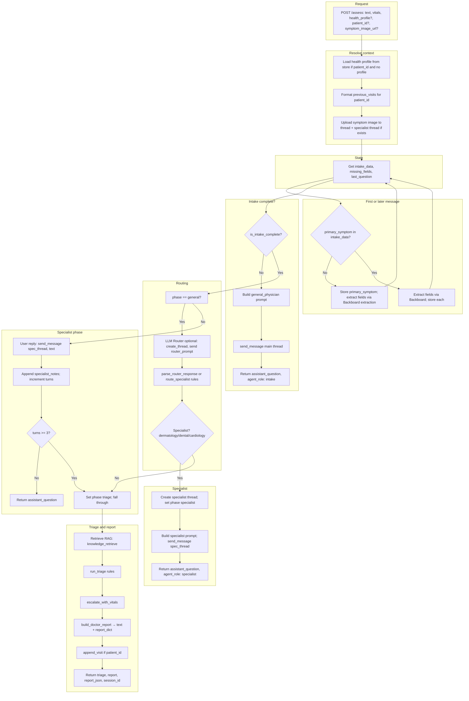
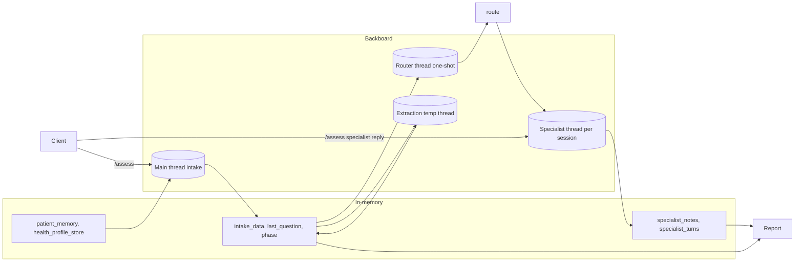

# Backend Architecture – Moha Health (AI Hospital Intake)

This document describes the full backend: multi-agent flow, Backboard usage, `/assess` lifecycle, specialist routing, vitals, voice, state, and data structures. A visual flow is at the end.

---

## 1. Multi-agent system end-to-end

The system uses **three agent roles** that run in sequence (with optional specialist handoff):

| Agent | Role | When active | Backboard usage |
|-------|------|-------------|-----------------|
| **Intake Nurse (General Physician)** | Asks for primary symptom, location, severity, duration, additional symptoms; can suggest symptom image or vitals. | From first message until all required fields are collected. | One **main thread** (`thread_id`): `send_message(thread_id, message)` with `general_physician_prompt.txt`. No persistent conversation history in Backboard across requests; prompt is built fresh each time with current `intake_data`, `missing_fields`, `last_question`, `user_response`. |
| **Specialist (Dermatology / Dental / Cardiology)** | Asks 1–3 focused follow-up questions in their domain. | After intake is complete and **routing** selects a specialist. | A **separate thread per specialist** per session: `spec_thread_id = create_thread(role=specialist_role)`. Prompt uses `dermatologist_prompt.txt`, `dentist_prompt.txt`, or `cardiologist_prompt.txt` with `conversation_summary`, `intake_data`, `health_profile`. Each user reply in specialist phase is sent with `send_message(spec_thread_id, text)`. |
| **Router (one-shot)** | Decides which specialist, if any, should take the case. | Once, when intake has just been completed and phase is still `general`. | A **temporary thread** (`router_thread = create_thread(role="general")`): one message with `router_prompt.txt`; reply is parsed to one of `dermatology` / `dental` / `cardiology` / `gastroenterology` / `general`. Not used for ongoing conversation. |

**Flow in short:**

1. **Intake phase:** Every user message is processed: extract structured fields (via **extraction** agent, see below), store in `thread_intake_data[thread_id]`, then if intake is not complete → build prompt for **Intake Nurse** and `send_message(thread_id, ...)` → return `assistant_question` and `agent_role: "intake"`.
2. **First time intake is complete:** Run **Router** (LLM + rule fallback) → if result is dermatology/dental/cardiology → create specialist thread, set phase to `specialist`, send first specialist message (context + prompt) → return that reply and `agent_role: <specialist>`.
3. **Specialist phase:** User messages go to `send_message(spec_thread_id, text)`. After each reply, append to `thread_specialist_notes` and increment `thread_specialist_turns`. When turns ≥ `MAX_SPECIALIST_TURNS` (3), set phase to `triage` and fall through.
4. **Triage phase:** Run **rule-based triage** (no Backboard), optionally **escalate with vitals**, build **clinical report** (text + JSON), append visit to **patient memory** (if `patient_id`), return `triage`, `report`, `report_json`, `session_id`, and `agent_role`.

So: **Intake Nurse** and **Specialist(s)** are Backboard agents (separate threads); **Router** is a one-off Backboard call; **Triage** and **Report** are in-process (rules + templates).

---

## 2. How Backboard is used (orchestration, memory, RAG)

- **Orchestration:**  
  - **Intake:** One global `thread_id = create_thread()` at app startup. Every `/assess` request that is still in intake uses this same thread: we build a **full prompt** (health profile, previous visits, intake_data, missing_fields, last_question, user_response) and call `send_message(thread_id, message)`. So the “conversation” is **stateless from Backboard’s perspective** per request; we re-inject state from our in-memory stores (`thread_intake_data`, `thread_last_question`) into the prompt each time.  
  - **Specialist:** When we hand off, we create a **new** Backboard thread per session: `create_thread(role=specialist_role)` and store it in `thread_specialist_thread_id[thread_id]`. Subsequent user messages in specialist phase are sent with `send_message(spec_thread_id, text)` so Backboard holds the specialist conversation for that session.  
  - **Extraction:** A **temporary** thread is created per extraction request: `create_thread()` then `send_message(temp_thread, extraction_prompt)`; the reply is parsed for JSON extractions; the thread is not reused.  
  - **Router:** Same idea: temporary thread, one message with `router_prompt.txt`, parse reply, thread discarded.

- **Memory:**  
  - **Conversation memory** for the **intake** agent is **not** stored in Backboard across requests; it’s our in-memory `thread_intake_data`, `thread_last_question`, and `thread_phase` keyed by `thread_id`.  
  - **Specialist** conversation is in Backboard (messages on `spec_thread_id`). We also mirror **specialist output** into `thread_specialist_notes[thread_id]` for the report.  
  - **Patient-level memory** (previous visits) is in **patient_memory** (in-memory dict keyed by `patient_id`), formatted and injected into the intake prompt as `previous_visits`.

- **RAG (documents in Backboard):**  
  - When the user provides a **symptom image URL**, we call `upload_document_to_thread(thread_id, image_url)` for the main intake thread and, if we’re in or later enter specialist phase, `upload_document_to_thread(spec_thread_id, image_url)`. So the image is attached to the Backboard thread(s) for the model to use (Backboard’s RAG/document handling).  
  - **Guideline RAG** for triage is **not** in Backboard: we use a separate **knowledge** service (keyword retrieval over `backend/knowledge/*.txt`). The retrieved text is passed as `rag_context` into **triage** and into the **report**, not into Backboard messages.

---

## 3. Complete flow of the `/assess` endpoint

From receiving a user message to returning either a follow-up question or a final triage result:

```
1. Parse request body
   - text, vitals, health_profile, locale, symptom_image_url, patient_id

2. Resolve health profile
   - If patient_id present and health_profile missing/empty → load from health_profile_store.
   - Format health_profile for prompts (_format_health_profile).

3. Previous visits (for prompt)
   - If patient_id → format_previous_visits_for_prompt(patient_id).

4. Symptom image
   - If symptom_image_url is HTTP(S) → upload_document_to_thread(thread_id, url)
     and, if specialist thread exists, upload_document_to_thread(spec_thread_id, url).

5. Load intake state
   - intake_data = get_intake_data(thread_id)
   - If "primary_symptom" not in intake_data → first message:
     - store_answer(thread_id, "primary_symptom", text)
     - extract_intake_fields(thread_id, user_input=text, last_question="(Patient's initial description)", missing_fields=[...])
     - For each parsed {field, value}: store_answer(thread_id, field, value) for required fields.
   - Else (later message):
     - missing_fields = get_missing_fields(thread_id), last_question = get_last_question(thread_id)
     - extract_intake_fields(thread_id, text, last_question, missing_fields)
     - Store each extracted field.

6. Refresh state
   - intake_data, missing_fields, last_question = get_* again.

7. If intake NOT complete
   - Build message from general_physician_prompt.txt (health_profile, previous_visits, primary_symptom, intake_data, missing_fields, last_question, user_response).
   - Add language and optional symptom image note.
   - response = send_message(thread_id, message)
   - store_last_question(thread_id, response)
   - Return { intake_data, assistant_question: response, specialist: "", agent_role: "intake" }.

8. Intake complete — routing (phase == "general")
   - Optionally: router_thread = create_thread(role="general"), router_reply = send_message(router_thread, router_prompt).
   - specialist_role = parse_router_response(router_reply) or route_specialist(primary_symptom, additional_symptoms, location).
   - If specialist_role in (dermatology, dental, cardiology):
     - spec_thread_id = create_thread(role=specialist_role)
     - set_specialist_thread_id(thread_id, spec_thread_id), set_specialist(thread_id, specialist_role), set_phase(thread_id, "specialist")
     - Upload symptom image to spec thread if present.
     - Build spec_message from dermatologist/dentist/cardiologist_prompt.txt (conversation_summary, intake_data, health_profile).
     - response = send_message(spec_thread_id, spec_message)
     - append_specialist_notes(thread_id, response), store_last_question(thread_id, response), increment_specialist_turns(thread_id)
     - Return { intake_data, assistant_question: response, specialist: specialist_role, agent_role: specialist_role }.
   - Else: set_phase(thread_id, "triage") and fall through to step 10.

9. Specialist phase (phase == "specialist")
   - spec_thread_id = get_specialist_thread_id(thread_id)
   - response = send_message(spec_thread_id, text)
   - append_specialist_notes(thread_id, response), store_last_question(thread_id, response), increment_specialist_turns(thread_id)
   - If specialist_turns >= MAX_SPECIALIST_TURNS (3): set_phase(thread_id, "triage") and fall through.
   - Else: return { intake_data, assistant_question: response, specialist: get_specialist(thread_id), agent_role: specialist }.

10. Triage + report (phase is "triage" or we just left specialist)
    - rag_context = knowledge_retrieve(symptom_summary, primary_symptom, additional_symptoms)
    - triage_result = run_triage(intake_data, health_profile_str, specialist_notes, rag_context)
    - triage_result = escalate_with_vitals(triage_result, vitals)
    - report_text, report_dict = build_doctor_report(...)
    - triage_result["confidence"] = report_dict["ai_confidence_score"]
    - If patient_id: append_visit(patient_id, ...)
    - Return { intake_data, triage: triage_result, report: report_text, report_json: report_dict, session_id: thread_id, specialist, agent_role }.
```

**Important:** All of the above uses a **single** `thread_id` created at startup. So in the current code, every request shares the same intake thread and the same in-memory state keyed by that `thread_id` (effectively one global session). For multi-user production, `thread_id` (and optionally specialist thread) would need to be per user/session.

---

## 4. Specialist routing (when handoff happens)

Handoff from Intake Nurse to a specialist happens **exactly once**, when:

- **Intake is complete** (all of `primary_symptom`, `location`, `severity`, `duration`, `additional_symptoms` are present), and  
- **Phase is still `"general"`.**

Then:

1. **LLM router (optional):** Load `router_prompt.txt` with `primary_symptom`, `location`, `additional_symptoms`. Create a temporary Backboard thread, send that prompt, get one-word reply. `parse_router_response(reply)` maps reply to one of: `dermatology`, `dental`, `cardiology`, `gastroenterology`, `general`.
2. **Rule-based fallback:** If the LLM reply is invalid or `general`, `route_specialist(primary_symptom, additional_symptoms, location)` runs:
   - **Dermatology:** keywords e.g. rash, skin, itch, lesion, acne, eczema, dermatitis, hive, blister, mole, burn, wart, fungal, psoriasis, etc.
   - **Dental:** tooth, teeth, gum, jaw, dental, mouth pain, oral, cavity, extraction, wisdom, molar, etc.
   - **Cardiology:** chest pain, chest tightness, heart, palpitation, shortness of breath, cardiac, heartburn, arm/jaw pain, pressure, squeezing.
   - **Gastroenterology:** stomach, abdomen, nausea, vomit, bowel, diarrhea, constipation, gi, digestive, belly.
3. **Handoff only for three roles:** If the chosen role is in `("dermatology", "dental", "cardiology")`, we create the specialist thread, set phase to `specialist`, and send the first specialist message. **Gastroenterology** is in the router options and in rule-based routing but **no specialist prompt/thread exists** for it, so it is treated like `general` and we go straight to triage.

So: **trigger** = intake just completed and phase is general; **decision** = LLM router + rule-based `route_specialist`; **actual handoff** = only for dermatology, dental, cardiology.

---

## 5. `/vitals/from-url` and rPPG (Presage)

- **Contract:** POST body `{ "url": "https://..." }` (e.g. Cloudinary video URL). Backend downloads the video to a temp file, then calls `get_vitals_from_video(tmp_path)`.
- **Current implementation:** In `services/vitals.py`, `get_vitals_from_video` is a **stub**: it does **not** call Presage or any rPPG API. It always returns `{ "heart_rate": 72, "respiration": 16 }`. The docstring says: “For the hackathon demo we return fixed vitals instead of calling the Presage Physiology API. Replace this with the real integration later.”
- **Intended design:** When implemented, the flow would be: download video from URL → save to temp file → call Presage (or similar) rPPG service with that file → return `heart_rate` and `respiration` (and optionally `stress_index`). So **today there is no real rPPG**; the pipeline (vitals → `escalate_with_vitals` → report) is ready for when `get_vitals_from_video` is wired to a real API.

---

## 6. `/speak` and `/transcribe` (ElevenLabs TTS and STT)

- **`/speak` (TTS)**  
  - Body: `{ "text", "voice_id" (optional) }`.  
  - Uses `voice.generate_voice(text, voice_id)`: ElevenLabs client `text_to_speech.convert(voice_id, text)` → returns MP3 bytes.  
  - Response: `StreamingResponse(iter([audio]), media_type="audio/mpeg")`.  
  - Errors: 400 if text empty; 429 if quota; 500 on other failures.

- **`/transcribe` (STT)**  
  - Upload: audio file (e.g. webm). Query: optional `language_code` (e.g. `en`, `fr`).  
  - Uses `voice.transcribe_audio(audio_file, filename, language_code)`: ElevenLabs `speech_to_text.convert(model_id="scribe_v2", file=..., language_code=...)` → returns text.  
  - Response: `{ "text": "<transcribed>" }`.  
  - 400 if empty file; 500 on transcription error.

So: **TTS** = ElevenLabs `text_to_speech.convert`; **STT** = ElevenLabs `speech_to_text.convert` (scribe_v2). No Backboard involved in voice.

---

## 7. Patient state and conversation history

- **Per “session” (keyed by `thread_id` — currently one global thread):**
  - `thread_intake_data[thread_id]`: dict of collected fields (primary_symptom, location, severity, duration, additional_symptoms).
  - `thread_last_question[thread_id]`: last AI message (for extraction and prompt context).
  - `thread_phase[thread_id]`: `"general"` | `"specialist"` | `"triage"`.
  - `thread_specialist[thread_id]`: `""` | `"dermatology"` | `"dental"` | `"cardiology"`.
  - `thread_specialist_thread_id[thread_id]`: Backboard thread id for the specialist.
  - `thread_specialist_turns[thread_id]`: number of specialist exchanges.
  - `thread_specialist_notes[thread_id]`: concatenated specialist replies for report.

- **Per patient (keyed by `patient_id`):**
  - **health_profile_store:** GET/PUT by `patient_id`; used when request has `patient_id` and no/empty health_profile.
  - **patient_memory:** last N visits per patient (primary_symptom, duration, severity, specialist, urgency); formatted as `previous_visits` for the intake prompt; new visit appended after triage when `patient_id` is present.

- **Conversation history in Backboard:**  
  - Intake: we don’t rely on Backboard conversation history; we re-send a full prompt each time.  
  - Specialist: Backboard holds the specialist thread messages; we don’t persist that history in our own store except as `thread_specialist_notes` (text only).

---

## 8. Middleware, error handling, fallbacks

- **CORS:** `CORSMiddleware` with `allow_origins=["*"]`, `allow_credentials=True`, `allow_methods=["*"]`, `allow_headers=["*"]`.
- **No global exception handler** in the doc; FastAPI’s default and HTTPException apply.
- **Assess:** No try/except around the whole assess body; Backboard/network errors can propagate. Extraction and router use try/except and fallback (e.g. empty extractions, fallback to rule routing).
- **Voice:** 400 for empty text; 429 for quota; 500 for other ElevenLabs errors.
- **Vitals:** Returns `{ "error": "..." }` on failure instead of raising.
- **Fallbacks:**
  - **Router:** If LLM router fails or returns invalid specialty → `route_specialist(...)` (rule-based).
  - **Extraction:** If Backboard returns nothing or unparseable → empty list; intake still proceeds with what’s stored.
  - **Report confidence:** Rule-based `_compute_confidence`; no LLM.

---

## 9. Data structures

### Triage result (returned as `triage` in `/assess` and used in report)

```python
{
    "urgency": "HIGH" | "MEDIUM" | "LOW",
    "department": str,           # e.g. "Emergency Medicine", "Urgent Care", "Primary Care"
    "reason": str,               # Short explanation
    "priority_level": 1 | 2 | 3,  # 1=HIGH, 2=MEDIUM, 3=LOW
    "triage_message": str,       # e.g. "Urgency level HIGH. Please proceed to Emergency Medicine."
    "confidence": float          # Added from report_dict["ai_confidence_score"] (0.0–1.0)
}
```

### Clinical report (text)

Plain text sections: Patient Identification, Optional Patient Info, Chief Complaint, Symptom History, Associated Symptoms, Patient Intake Summary, Uploaded Media, Image Analysis, Vitals, Specialist Analysis, Possible Considerations, Clinical Context, Triage Decision, Reason, AI Notes, Disclaimer, AI Confidence Score.

### report_json (full structure)

```python
{
    "patient_identification": { "patient_id", "session_id", "date", "time", "source" },
    "optional_patient_info": { "age", "sex", "known_conditions", "medications", "allergies" },
    "chief_complaint": str,
    "symptom_history": { "symptom_onset", "progression", "severity", "location" },
    "associated_symptoms": list[str],
    "patient_intake_summary": list[str],
    "uploaded_media": { "symptom_image": "Provided"|"Not Provided", "vitals_video": "..." },
    "image_analysis": str,
    "vitals": { "heart_rate", "respiration_rate", "stress_index" },
    "specialist_analysis": str,
    "possible_considerations": list[str],
    "clinical_context": str,
    "triage_decision": { "urgency_level", "priority_level", "recommended_department" },
    "reason": str,
    "ai_notes_for_physician": str,
    "ai_assistance_disclaimer": str,
    "ai_confidence_score": float
}
```

---

## 10. Visual: end-to-end flow



### Agent and thread usage



---

## Summary table

| Component | Technology | Role |
|-----------|------------|------|
| Intake agent | Backboard (one global thread) + prompts | Asks for required fields; prompt includes our state each time |
| Specialist agents | Backboard (one thread per specialist per session) | Dermatology / Dental / Cardiology follow-up |
| Router | Backboard one-shot + rule-based fallback | Decides specialist or general |
| Extraction | Backboard temp thread + extraction_prompt | Parses user message to structured fields |
| Triage | In-process rules (symptom_normalizer + rules) | Urgency, department, reason |
| Vitals escalation | In-process (vitals_triage) | HR/RR thresholds → HIGH urgency |
| Report | In-process (report.build_doctor_report) | Text + JSON from template + confidence |
| RAG (guidelines) | Keyword retrieval over knowledge/*.txt | Context for triage/report only |
| RAG (image) | Backboard upload_document_to_thread | Symptom image on intake + specialist threads |
| Voice TTS/STT | ElevenLabs | /speak, /transcribe |
| Vitals from video | Stub (Presage/rPPG not wired) | /vitals, /vitals/from-url return placeholder |
| Patient state | In-memory dicts keyed by thread_id, patient_id | Intake, phase, specialist, notes, visits, health profile |

This is the full backend architecture as implemented; the visuals above can be rendered in any Mermaid-supported viewer (e.g. GitHub, VS Code, or [mermaid.live](https://mermaid.live)).
